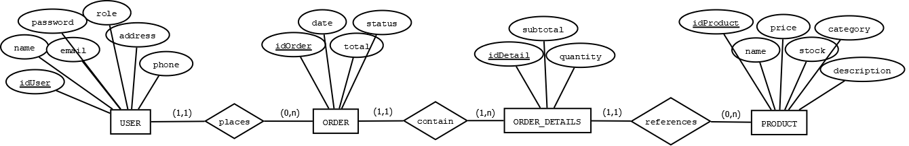

## 4.4.1 Diagrama Entidad-Relación (E-R)

Para diseñar la base de datos hemos identificado las entidades principales del sistema y cómo se relacionan entre sí. La base de datos da soporte exclusivamente a la aplicación JavaFX, que gestiona la parte administrativa de la plataforma: usuarios, productos y pedidos.

**USER** centraliza los datos de todos los usuarios registrados: nombre, email, contraseña, rol, dirección y teléfono. El atributo `role` distingue entre alumno y administrador dentro de la misma entidad.

**ORDER** registra cada pedido realizado por un usuario. Guardamos la fecha, el total y el estado actual. Un usuario puede realizar cero o muchos pedidos, pero cada pedido pertenece siempre a un único usuario.

**ORDER_DETAILS** desglosa el contenido de cada pedido: qué productos se compraron, en qué cantidad y a qué precio. Es necesaria como entidad independiente porque un pedido puede contener varios productos distintos.

**PRODUCT** representa cada artículo disponible en la tienda, almacenando su nombre, descripción, precio, categoría y stock disponible. Un producto puede aparecer en muchos pedidos distintos, pero cada línea de detalle siempre referencia a un único producto.

---

## Archivos

| Archivo | Descripción |
|---|---|
| `ERDiagramaScotty.png` | Imagen exportada del diagrama E-R |
| `ERDiagramaScotty.drawio` | Archivo fuente editable (diagrams.net) |

---

⬅️ [Volver al índice](../../README.md) · ➡️ [Modelo Relacional](../relational/README.md)
