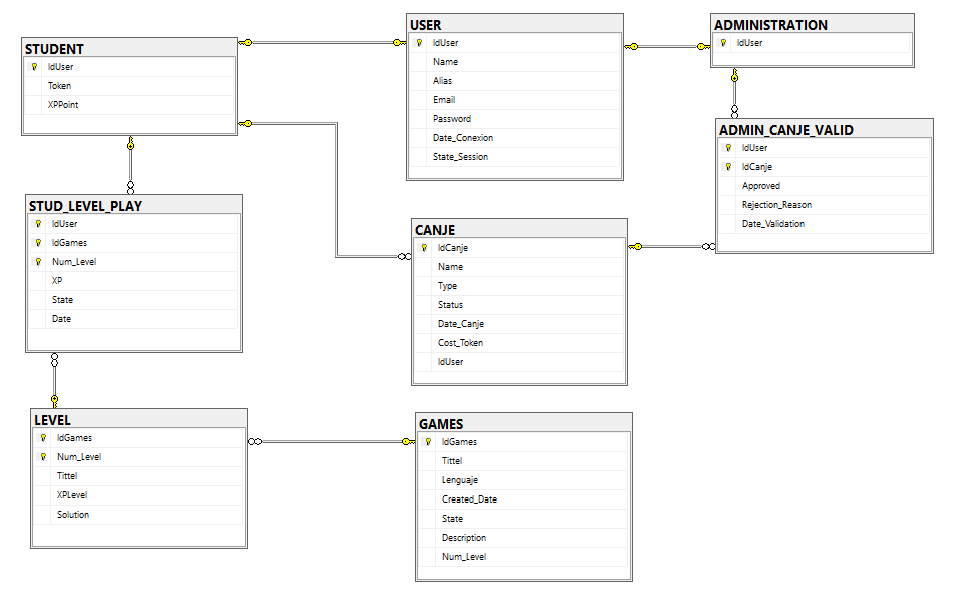

# 4.4.3 Diagrama de tablas SQL
 
Con el modelo relacional definido, hemos trasladado toda la estructura a SQL Server. Este diagrama muestra visualmente las tablas resultantes, sus campos y las relaciones entre ellas.
 

 
---
 
## Decisiones de implementación
 
**Constraints CHECK**
Para garantizar la integridad de los datos desde la propia base de datos, hemos aplicado constraints CHECK en todos los campos que solo admiten valores concretos: el formato del email, el estado de sesión, los lenguajes disponibles, el estado del canje y el estado del nivel. Así no dependemos únicamente de las validaciones del backend.
 
**Valores por defecto**
Para los campos con valores predecibles hemos definido valores por defecto directamente en la tabla: `State_Session` arranca como `'disabled'`, el `Status` del canje como `'pending'`, el `State` del nivel como `'BLOQUEADO'` y todas las fechas toman el valor del momento de inserción con `GETDATE()`.
 
**Clave primaria compuesta en STUD_LEVEL_PLAY**
La tabla tiene clave primaria formada por tres campos: `IdUser`, `IdGames` y `Num_Level`, ya que necesitamos identificar de forma única cada combinación de estudiante y nivel para registrar correctamente su progreso individual.
 
---
 
## Archivos
 
| Archivo | Descripción |
|---|---|
| `diagrama_tablas.png` | Diagrama visual de las tablas generado en SQL Server |
 
---
 
⬅️ [Modelo Relacional](../relational/README.md) · ➡️ [Script DDL](../../sql/ddl/README.md)
 
