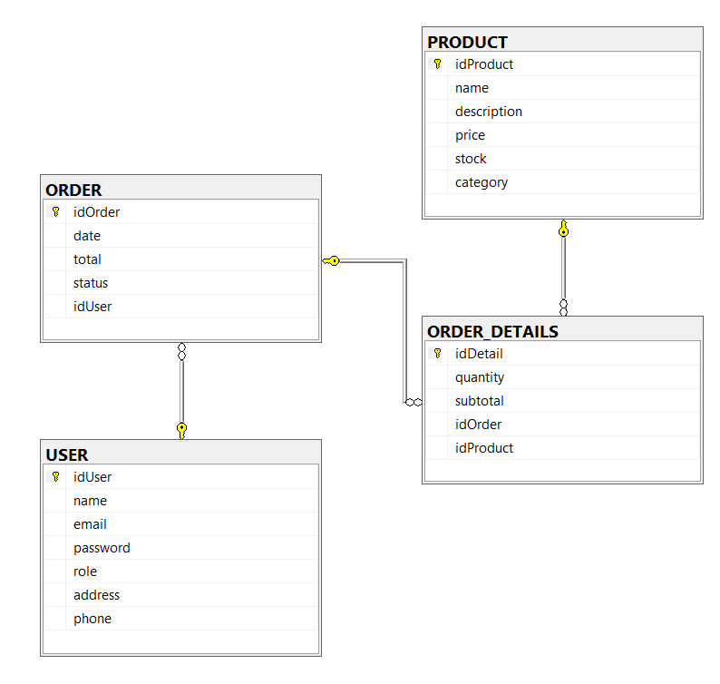

# 4.4.3 Diagrama de tablas SQL

Con el modelo relacional definido, hemos trasladado toda la estructura a SQL Server. Este diagrama muestra visualmente las tablas resultantes, sus campos y las relaciones entre ellas.

---

## Decisiones de implementación

**CHECK**
Hemos aplicado CHECK en los campos que solo admiten valores concretos: el formato del email, el rol del usuario, el estado del pedido, las categorías de producto y el formato del teléfono. Así garantizamos la integridad de los datos desde la propia base de datos, sin depender únicamente de las validaciones de JavaFX.

**Valores por defecto**
Para los campos con valores predecibles hemos definido valores por defecto directamente en las tablas: `role` arranca como `'ALUMNI'`, el `status` del pedido como `'PENDING'`, el `stock` como `0` y la fecha del pedido toma el valor del momento de inserción con `GETDATE()`.

**UNIQUE en email**
Hemos marcado el campo `email` de USER como UNIQUE para garantizar que no puedan existir dos usuarios con el mismo correo registrado en el sistema.

**Claves foráneas**
`ORDER` apunta a `USER` para saber quién realizó cada pedido. `ORDER_DETAILS` apunta tanto a `ORDER` como a `PRODUCT` para registrar qué productos forman parte de cada pedido.

**Palabras reservadas**
`ORDER` y `USER` van entre corchetes porque son palabras reservadas en SQL Server y sin ellos el script daría error al ejecutarse.

---

## Archivos

| Archivo | Descripción |
|---|---|
| `diagrama_tablas2.png` | Diagrama visual de las tablas generado en SQL Server |

---

⬅️ [Modelo Relacional](../relational/README.md) · ➡️ [Script DDL](../../sql/ddl/README.md)
